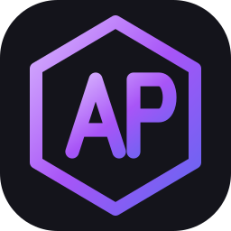
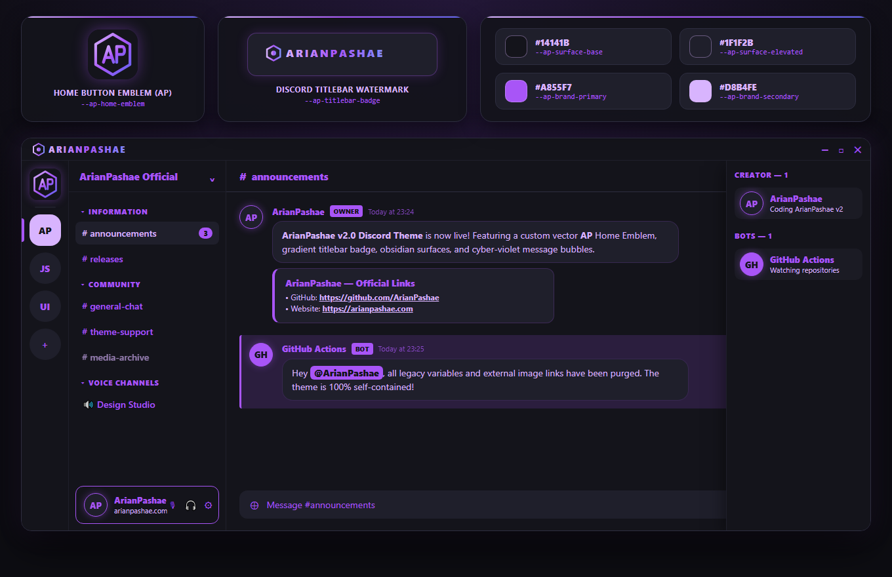

<div align="center">



# ArianPashae — Discord Theme

**A sleek, customizable Obsidian & Cyber-Violet theme for Discord, designed and engineered by [ArianPashae](https://github.com/ArianPashae).**

[](https://github.com/ArianPashae/ArianPashae-Discord-Theme/releases/latest/download/ArianPashae.theme.css)
[](https://github.com/ArianPashae/ArianPashae-Discord-Theme/releases/latest)
[](https://github.com/ArianPashae/ArianPashae-Discord-Theme/stargazers)
[](https://arianpashae.com)

<br />

**Supported Clients:** &nbsp; `Vencord` &nbsp;•&nbsp; `BetterDiscord` &nbsp;•&nbsp; `Vesktop` &nbsp;•&nbsp; `Replugged`

</div>

---

##  &nbsp;Theme Preview



---

##  &nbsp;Features

- **Obsidian & Cyber-Violet Palette** — Deep obsidian backgrounds (`#14141b` & `#1f1f2b`) paired with vibrant electric violet (`#a855f7`) and soft lavender (`#d8b4fe`) accents for a sharp, eye-friendly dark mode.
- **Auto-Expanding Member Drawer** — Keeps your chat view wide by collapsing the right member list to `60px` and smoothly expanding it when hovered.
- **Modern Message Bubbles** — Clean rounded message cards with subtle glowing borders and smooth avatar hover elevation.
- **Built-In Streamer Privacy Shield** — Automatically blurs sensitive account fields in User Settings until you hover over them.
- **Custom Vector Branding** — Features the signature `AP` hexagon Home button emblem and `ARIANPASHAE` titlebar badge with zero external image dependencies.
- **100% Customizable** — Change colors, glow intensity, corner roundness, or the Home icon in seconds using simple CSS variables.

---

##  &nbsp;Installation Guide

### Method 1: Vencord / Vesktop (Online Link — Fastest)

If you use **Vencord** or **Vesktop**, you can load the theme directly without downloading any files:

1. Open Discord **User Settings** → go to **Vencord** → **Themes**.
2. Switch to the **Online Themes** tab.
3. Paste the following link into the input box:

```text
https://arianpashae.github.io/ArianPashae-Discord-Theme/ArianPashae.theme.css
```

---

### Method 2: BetterDiscord & Vencord (Local File — Recommended for Customization)

Use this method if you use **BetterDiscord** or want to customize the theme's colors:

1. [**Click here to download `ArianPashae.theme.css`**](https://github.com/ArianPashae/ArianPashae-Discord-Theme/releases/latest/download/ArianPashae.theme.css) *(or download it from the [Releases](https://github.com/ArianPashae/ArianPashae-Discord-Theme/releases) page)*.
2. Open Discord **User Settings** → scroll down to **BetterDiscord** (or **Vencord**) → click **Themes**.
3. Click the **Open Themes Folder** button at the top.
4. Drag and drop `ArianPashae.theme.css` into the folder that opens.
5. Enable **ArianPashae** in your themes list.

---

##  &nbsp;How to Customize Colors & Style

Open `ArianPashae.theme.css` in any text editor (such as Notepad or VS Code). You can edit any of the `:root` variables below and save the file to see your changes live in Discord:

| Variable | Default Value | What It Controls |
| :--- | :--- | :--- |
| `--ap-surface-base` | `#14141b` | Main background across chat, channels, and sidebars |
| `--ap-surface-elevated` | `#1f1f2b` | Message bubbles, input bars, popouts, and cards |
| `--ap-surface-border` | `#2e2e40` | Subtle borders and dividers |
| `--ap-brand-primary` | `#a855f7` | Main accent color (icons, badges, buttons, titles) |
| `--ap-brand-secondary` | `#d8b4fe` | Links, active channel names, and hover highlights |
| `--ap-brand-glow` | `rgba(168, 85, 247, 0.38)` | Glow effect around avatars and the Home button |
| `--ap-home-emblem` | `url("data:image/svg+xml,...")` | Custom Home button icon (`url('https://...')` supported) |

<details>
<summary> &nbsp;<b>Click to view Ready-to-Use Color Presets (Copy & Paste into ArianPashae.theme.css)</b></summary>

<br />

#### 1. Cyber Violet (Default)
```css
:root {
  --ap-surface-base: #14141b;
  --ap-surface-elevated: #1f1f2b;
  --ap-surface-border: #2e2e40;
  --ap-brand-primary: #a855f7;
  --ap-brand-secondary: #d8b4fe;
  --ap-brand-glow: rgba(168, 85, 247, 0.38);
}
```

#### 2. Crimson Phantom (Red & Obsidian)
```css
:root {
  --ap-surface-base: #141114;
  --ap-surface-elevated: #221a1f;
  --ap-surface-border: #38242c;
  --ap-brand-primary: #f43f5e;
  --ap-brand-secondary: #fda4af;
  --ap-brand-glow: rgba(244, 63, 94, 0.38);
}
```

#### 3. Oceanic Cyan (Cyber Blue)
```css
:root {
  --ap-surface-base: #0f172a;
  --ap-surface-elevated: #1e293b;
  --ap-surface-border: #334155;
  --ap-brand-primary: #38bdf8;
  --ap-brand-secondary: #bae6fd;
  --ap-brand-glow: rgba(56, 189, 248, 0.38);
}
```

#### 4. Emerald Matrix (Neon Green)
```css
:root {
  --ap-surface-base: #0f1715;
  --ap-surface-elevated: #182723;
  --ap-surface-border: #264039;
  --ap-brand-primary: #10b981;
  --ap-brand-secondary: #6ee7b7;
  --ap-brand-glow: rgba(16, 185, 129, 0.38);
}
```

</details>

---

<div dir="rtl">

##  &nbsp;راهنمای نصب و استفاده (فارسی)

تم **ArianPashae** یک پوستهٔ مدرن، تاریک و شخصی‌سازی‌شده با ترکیب رنگی مشکی ابسیدین و بنفش نئونی برای دیسکورد است که توسط **[ArianPashae](https://github.com/ArianPashae)** طراحی و توسعه داده شده است.

###  &nbsp;قابلیت‌های تم

- طراحی چشم‌نواز با پس‌زمینهٔ ابسیدین (`#14141b`) و رنگ‌های بنفش نئونی (`#a855f7`) برای جلوگیری از خستگی چشم در استفادهٔ طولانی‌مدت
- حباب‌های پیام مدرن همراه با درخشش نئونی دور آواتار کاربران
- جمع شدن خودکار لیست اعضای سرور در سمت راست برای بازتر شدن فضای چت (با بردن ماوس روی لیست اعضا، به‌نرمی باز می‌شود)
- مخفی‌سازی و تار شدن خودکار اطلاعات حساس اکانت در تنظیمات دیسکورد برای امنیت بیشتر هنگام استریم یا اشتراک‌گذاری صفحه
- لوگوی وکتور اختصاصی `AP` روی دکمهٔ Home و نشان `ARIANPASHAE` در نوار بالای پنجره

---

###  &nbsp;آموزش نصب در دیسکورد

#### روش اول: نصب سریع با لینک مستقیم (مخصوص Vencord و Vesktop)

اگر از **Vencord** یا **Vesktop** استفاده می‌کنید، بدون نیاز به دانلود فایل می‌توانید تم را با لینک مستقیم فعال کنید:

۱. وارد تنظیمات دیسکورد (**User Settings**) شوید و از منوی کناری به بخش **Vencord** و سپس **Themes** بروید.  
۲. وارد تب **Online Themes** شوید.  
۳. لینک زیر را در کادر مربوطه کپی و پیست کنید تا تم در لحظه اعمال شود:

<div dir="ltr">

```text
https://arianpashae.github.io/ArianPashae-Discord-Theme/ArianPashae.theme.css
```

</div>

#### روش دوم: نصب با فایل تم (مخصوص BetterDiscord و Vencord)

اگر از **BetterDiscord** استفاده می‌کنید یا می‌خواهید رنگ‌های تم را به سلیقهٔ خودتان تغییر دهید:

۱. فایل [**`ArianPashae.theme.css`**](https://github.com/ArianPashae/ArianPashae-Discord-Theme/releases/latest/download/ArianPashae.theme.css) را دانلود کنید.  
۲. در دیسکورد وارد **User Settings** شوید و به بخش **Themes** (در قسمت BetterDiscord یا Vencord) بروید.  
۳. روی دکمهٔ **Open Themes Folder** در بالای صفحه کلیک کنید تا پوشهٔ تم‌ها باز شود.  
۴. فایل `ArianPashae.theme.css` را داخل این پوشه قرار دهید و از داخل دیسکورد کلید تم **ArianPashae** را روشن کنید.

---

###  &nbsp;آموزش تغییر رنگ‌ها و شخصی‌سازی

برای تغییر رنگ‌های تم یا گذاشتن عکس دلخواه روی دکمهٔ Home، کافی است فایل `ArianPashae.theme.css` را با برنامهٔ Notepad یا VS Code باز کنید و کدهای رنگ داخل بخش `:root` را تغییر دهید:

- متغیر `--ap-surface-base` برای رنگ پس‌زمینهٔ اصلی دیسکورد
- متغیر `--ap-surface-elevated` برای رنگ حباب پیام‌ها و کادرهای چت
- متغیر `--ap-brand-primary` برای رنگ اصلی تم (آیکون‌ها، دکمه‌ها و بج‌ها)
- متغیر `--ap-brand-secondary` برای رنگ لینک‌ها و کانال‌های انتخاب‌شده
- متغیر `--ap-home-emblem` برای تغییر لوگوی دکمهٔ Home در بالا سمت چپ

</div>

---

##  &nbsp;Author & Credits

Designed and maintained by **[ArianPashae](https://github.com/ArianPashae)**.

- **GitHub**: [@ArianPashae](https://github.com/ArianPashae)
- **Website**: [arianpashae.com](https://arianpashae.com)
- **License**: Released under the [MIT License](LICENSE).


## 🤝 Collaborative Development & Community
Contributions, issue reports, and community feature suggestions are always welcome.
See the [Discussions](https://github.com/ArianPashae/ArianPashae-Discord-Theme/discussions) tab to participate in theme evolution and release roadmaps.
<!-- optimization pass 1 1791544000914 -->
<!-- optimization pass 2 1791544007166 -->
